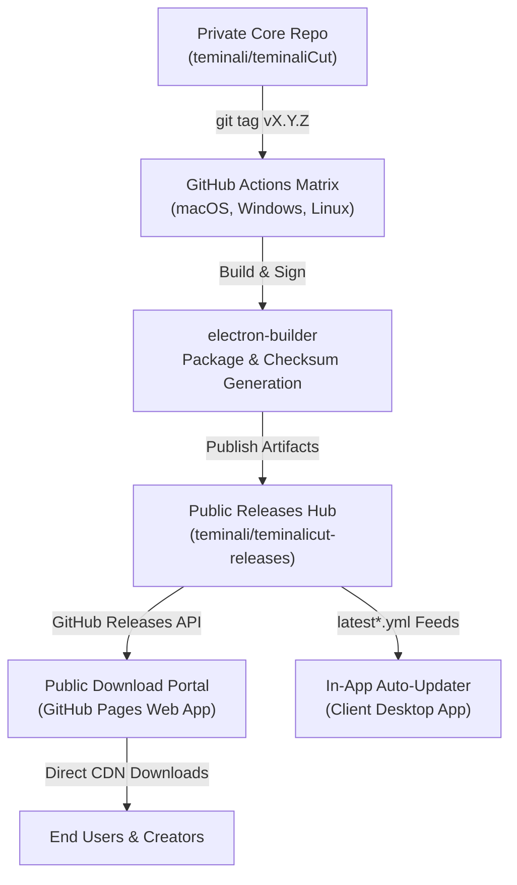

# TeminaliCut / Kerf — Release Hosting & Distribution Architecture

This document details the release hosting infrastructure, automated multi-platform build pipeline, and public distribution workflow for **TeminaliCut** (formerly Kerf).

---

## 1. Architectural Overview

To protect proprietary core codebase and editing engine IP while maintaining a seamless, zero-friction public distribution experience for end users, TeminaliCut utilizes a **Two-Tier Repository Architecture**:



### Components:
1. **Private Core Repository (`teminali/teminaliCut`)**:
   - Contains full source code, Electron main process, WebGL2/WebCodecs engine, MCP tools, React editor interface, and test suites.
   - Visibility: `Private`.
2. **Public Releases Hub (`teminali/teminalicut-releases`)**:
   - Houses public GitHub Releases, release notes, verified binaries (`.dmg`, `.exe`, `.AppImage`, `.zip`), and YAML feed manifests (`latest.yml`, `latest-mac.yml`).
   - Visibility: `Public`.
3. **Public Web Portal & Documentation (`https://teminali.github.io/teminalicut-releases/`)**:
   - Modern, SEO-optimized web landing page and download hub.
   - Features automatic OS detection, direct multi-architecture downloads, live release notes, and SHA-512 checksum verifier.

---

## 2. Multi-Platform Build Pipeline

Releases are compiled natively on target operating systems using GitHub Actions runner matrix defined in `.github/workflows/release.yml`.

### Matrix Strategy:
| Platform | Target Architecture | Package Format | Runner OS | Output File |
| :--- | :--- | :--- | :--- | :--- |
| **macOS (Apple Silicon)** | `arm64` (M1/M2/M3/M4) | DMG / ZIP | `macos-14` | `TeminaliCut-1.12.6-macOS-arm64.dmg` |
| **macOS (Intel)** | `x64` (Intel Core) | DMG / ZIP | `macos-13` / `macos-14` | `TeminaliCut-1.12.6-macOS-x64.dmg` |
| **Windows** | `x64` (64-bit) | NSIS Setup EXE | `windows-latest` | `TeminaliCut-Setup-1.12.6-Windows-x64.exe` |
| **Linux** | `x64` (`x86_64`) | AppImage | `ubuntu-latest` | `TeminaliCut-1.12.6-Linux-x86_64.AppImage` |

### Package Configuration (`electron-builder.yml`):
- **Native Modules**: `uiohook-napi` is N-API ABI-stable and prebuilt across platforms; `npmRebuild: false` avoids unnecessary C++ compilation steps on CI runners.
- **Code Signing & Ad-hoc Signature**: `build/afterPack.cjs` signs ad-hoc builds on macOS to allow gatekeeper compliance.
- **Compression**: Highest LZMA/deflate compression for fast installer downloads.

---

## 3. Release Hosting & Feed Manifests

The auto-updater system in [`electron/updater.ts`](file:///Users/teminali/Documents/my_projects/teminaliCut/electron/updater.ts) reads YAML manifest feeds published with each release:

1. **`latest-mac.yml`**: Contains macOS versions, asset URLs, and SHA-512 hashes for `arm64` and `x64`.
2. **`latest.yml`**: Contains Windows installer hashes and NSIS update packages.
3. **`latest-linux.yml`**: Contains Linux AppImage metadata.

### Checksum Verification:
Every binary uploaded to the release is accompanied by a cryptographic SHA-512 hash generated during the packaging step. When downloading:
- The desktop in-app updater validates the SHA-512 checksum of downloaded chunks against the feed before staging an update.
- Users downloading manually from the web portal can verify the hash in the browser or terminal (`shasum -a 512 <file>` or `certutil -hashfile <file> SHA512`).

---

## 4. How to Publish a New Release

To publish a new version:

### Step 1: Update Version & Changelog
1. Update `"version"` in [`package.json`](file:///Users/teminali/Documents/my_projects/teminaliCut/package.json).
2. Add the release entry at the top of [`src/services/changelog.ts`](file:///Users/teminali/Documents/my_projects/teminaliCut/src/services/changelog.ts).

### Step 2: Run Verification & Build Checks
```bash
npm run typecheck
npm test
npm run build
```

### Step 3: Commit and Tag
```bash
git add .
git commit -m "chore(release): v1.12.6"
git tag -a v1.12.6 -m "Release v1.12.6"
git push origin main
git push origin v1.12.6
```

### Step 4: Automated CI Execution
GitHub Actions will:
1. Initialize the release object on GitHub.
2. Build native packages in parallel on macOS, Windows, and Ubuntu.
3. Upload binaries, zip archives, and update manifests to the release.
4. The public portal automatically picks up the new release via GitHub API without requiring manual site rebuilds.

---

## 5. Google SEO & Discoverability Configuration

The public download portal implements comprehensive search engine optimizations:

- **JSON-LD Schema (`SoftwareApplication`)**: Embedded structured data indexing application category, supported OS platforms, price ($0/Free), and software version.
- **Semantic Meta Tags**: Complete OpenGraph and Twitter Card metadata for rich social previews.
- **Sitemap & Robots**: `sitemap.xml` and `robots.txt` configured with indexing rules and canonical URLs.
- **Fast Global Delivery**: Hosted over GitHub Pages with global CDN caching and Brotli/gzip compression.
